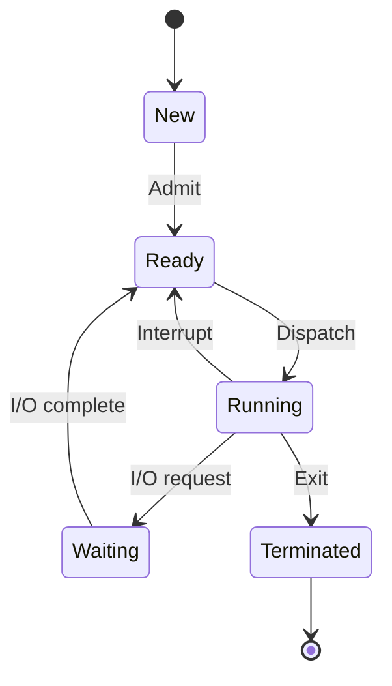
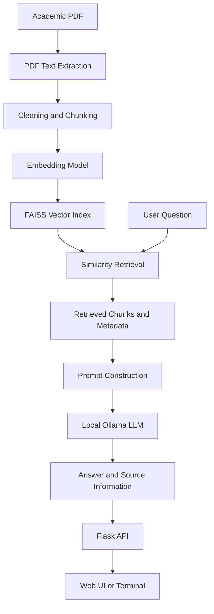
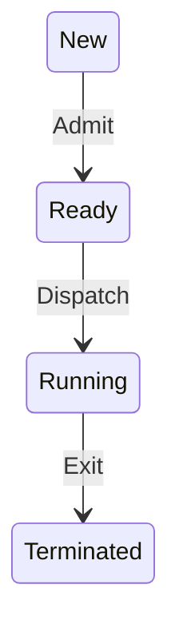

<div align="center">

# 🧠 StudyRAG
### Your Knowledge. Your Models. Your Machine.

**An offline-first, privacy-focused AI study assistant for learning from your own academic documents.**

[](https://www.python.org/)
[](https://flask.palletsprojects.com/)
[](https://ollama.com/)
[](https://github.com/facebookresearch/faiss)
[](#-privacy--offline-first-design)
[](#-roadmap)

*Turn textbooks, lecture notes, syllabi, lab manuals, and question papers into a searchable, conversational study workspace.*

</div>

---

## 📚 Table of Contents

- [Overview](#-overview)
- [Why StudyRAG?](#-why-studyrag)
- [Core Principles](#-core-principles)
- [Feature Matrix](#-feature-matrix)
- [Version History](#-version-history)
  - [V1.0 — Foundation](#-v10--foundation)
  - [V1.1 — Ingestion and Retrieval Improvements](#-v11--ingestion-and-retrieval-improvements)
  - [V2.0 — Study Workspace](#-v20--study-workspace)
  - [V2.1 — Conversation and Context Improvements](#-v21--conversation-and-context-improvements)
  - [V2.2 — Visual Learning Engine](#-v22--visual-learning-engine)
  - [V2.3 — Planned Expansion](#-v23--planned-expansion)
- [System Architecture](#-system-architecture)
- [How RAG Works in StudyRAG](#-how-rag-works-in-studyrag)
- [Technology Stack](#-technology-stack)
- [Project Structure](#-project-structure)
- [Requirements](#-requirements)
- [Installation](#-installation)
- [Running StudyRAG](#-running-studyrag)
- [Configuration](#-configuration)
- [Using StudyRAG](#-using-studyrag)
- [API Overview](#-api-overview)
- [Visual Learning Engine](#-visual-learning-engine)
- [Storage and Data](#-storage-and-data)
- [Privacy and Offline-First Design](#-privacy--offline-first-design)
- [Performance and Resource Awareness](#-performance-and-resource-awareness)
- [Testing and Quality](#-testing-and-quality)
- [Troubleshooting](#-troubleshooting)
- [Security Considerations](#-security-considerations)
- [Roadmap](#-roadmap)
- [Contributing](#-contributing)
- [License](#-license)
- [Acknowledgements](#-acknowledgements)

---

## 🌌 Overview

**StudyRAG** is a local-first AI study assistant designed to help learners ask questions about their own academic materials. Rather than relying entirely on a general-purpose chatbot's pretrained knowledge, StudyRAG can retrieve relevant passages from user-provided documents and use those passages as context for an answer.

The project combines **Retrieval-Augmented Generation (RAG)** with locally executed language models. Academic files are processed into text chunks, converted into vector embeddings, indexed for similarity search, and retrieved when a question is asked. A local language model can then formulate an answer using the retrieved evidence.

The broader vision is a personal study environment where students can:

- Import academic PDFs and learning resources.
- Ask natural-language questions about their materials.
- Receive answers grounded in retrieved document passages.
- Preserve document and page metadata for traceability.
- Explore concepts using diagrams and visual explanations.
- Continue conversations in a dedicated study workspace.
- Run the core workflow without sending academic documents to a cloud AI API.

StudyRAG is intended to be **modular, understandable, resource-conscious, and extensible**. The project is evolving; the status labels throughout this README intentionally distinguish established foundations from features that still need end-to-end verification.

### Project at a glance

| Area | Description |
|---|---|
| Project type | Local AI learning and document-question-answering application |
| Primary method | Retrieval-Augmented Generation (RAG) |
| Web layer | Flask |
| Document extraction | PyMuPDF |
| Embeddings | Sentence Transformers |
| Vector retrieval | FAISS |
| Local language model runtime | Ollama |
| Current lightweight LLM example | `qwen3:1.7b` |
| Frontend | HTML, CSS, JavaScript |
| Conversation persistence | MongoDB integration in the evolving application |
| Visual diagrams | Mermaid-based diagram generation and rendering |
| Primary design goal | Local-first processing and user control |

> **Implementation note:** This README documents the intended architecture and the capabilities discussed during development. Verify each feature against the current repository before treating this document as a release certification. In particular, routes, environment-variable names, database settings, and version boundaries may differ in the actual code.

---

## 🎯 Why StudyRAG?

Academic work is often spread across large PDFs, lecture slides, lab manuals, handwritten-note scans, textbooks, and previous examination papers. Finding one relevant explanation can take longer than understanding it.

A general chatbot can explain concepts, but may not know the exact content of a student's course material. A document viewer can show the source, but does not naturally answer follow-up questions.

StudyRAG brings these workflows together:

| Common challenge | StudyRAG approach |
|---|---|
| Large PDFs are difficult to search semantically | Split extracted text into searchable chunks and retrieve relevant passages |
| Generic answers may not match course notes | Supply retrieved academic passages as model context |
| Students need to trace information | Preserve source-document and page metadata where available |
| Cloud services may expose private learning material | Design the core workflow to use local processing |
| Repeated questions need context | Provide a chat-oriented workflow, with persistence depending on configured components |
| Some topics are easier to understand visually | Generate Mermaid-style technical diagrams where supported |
| Consumer hardware has limited memory | Prefer compact local models and configurable retrieval settings |

### Intended audience

- University and college students
- Learners studying from PDFs and lecture notes
- Students preparing for examinations and viva questions
- Developers experimenting with local RAG systems
- Privacy-conscious users who prefer local inference
- Educators building document-grounded learning tools

---

## 🧭 Core Principles

### 1. Local-first, not cloud-dependent

The core question-answering workflow is designed around a local embedding model, local vector index, and Ollama-hosted local LLM. Internet access may still be needed to install dependencies or obtain models initially, but ordinary operation should not require a paid cloud AI API.

### 2. Retrieval before generation

StudyRAG should search the available study material before generating a document-grounded answer. If relevant evidence cannot be found, the application should communicate that limitation rather than imply that a document supports an unsupported claim.

### 3. Source awareness

Document names and page numbers are important metadata. They should survive ingestion, chunking, indexing, retrieval, and presentation wherever the source format makes that possible.

### 4. Modular engineering

Document ingestion, chunking, embeddings, retrieval, model communication, conversation storage, visualization, and UI presentation should remain separate enough to test and improve independently.

### 5. Resource-aware defaults

A useful local application should account for CPU, RAM, disk space, model size, and generation latency. Large optional models must not be downloaded automatically.

### 6. Honest feature reporting

A successful API response does not necessarily mean that the browser rendered the result correctly. Features should be considered complete only after their full path—from input to visible output—has been tested.

---

## ✅ Feature Matrix

The matrix below is a **development-oriented snapshot**, not a guarantee that every feature is currently working in every environment.

| Capability | Status | Notes |
|---|---|---|
| Flask application foundation | Implemented foundation | Confirm startup and routes in the current checkout |
| PDF text extraction | Implemented foundation | PyMuPDF is used in the ingestion workflow |
| Text chunking | Implemented foundation | Chunk boundaries and overlap should be verified against current settings |
| Local sentence embeddings | Implemented foundation | Sentence Transformers; `all-MiniLM-L6-v2` was used in the V1 workflow |
| FAISS vector search | Implemented foundation | A local index was used for retrieval |
| Source and page metadata | Implemented foundation | Preserve metadata throughout the full pipeline |
| Local Ollama inference | Implemented foundation | `qwen3:1.7b` has been used for local generation |
| Retrieval-grounded answers | Implemented foundation | Retrieval quality depends on content, chunking, and configuration |
| Top-k retrieval configuration | Evolving | V1.1 used top 5; V2 requirements targeted top 10 |
| Web chat interface | Implemented foundation | UI has evolved across versions |
| Terminal interaction mode | V2 target / verify | Confirm it exists and works in the current repository |
| Chat history persistence | Evolving | MongoDB integration has been part of the V2 direction |
| Conversation context | Evolving | Verify how previous turns are selected and injected into prompts |
| Markdown answer rendering | V2 target / verify | Ensure untrusted content is rendered safely |
| Mermaid diagram generation | Experimental / verify end-to-end | Model output must be parsed and validated |
| Mermaid SVG rendering | Experimental / verify end-to-end | Requires valid Mermaid source and a working renderer |
| Actual AI-generated image output | Optional / not established by Mermaid alone | Requires a separate image-generation backend |
| Offline operation | Design goal | Dependencies and required models must already be installed locally |
| Automated test coverage | Verify | Run the repository's test suite before publishing a release |

**Status definitions**

- **Implemented foundation:** A component has been used or established during development, but a release should still be tested.
- **Evolving / verify:** The capability is part of the development direction; confirm its actual implementation and end-to-end behavior.
- **Experimental:** It may work for supported inputs but needs validation, error handling, and regression testing.
- **Planned:** A future objective, not a claim about the current code.

---

# 🧱 Version History

StudyRAG's version labels describe the project's development stages and intended capabilities. Unless a release tag and matching source code are available, treat this as a **project development history**, not a claim that every version was formally published.

## 🟦 V1.0 — Foundation

**Theme:** Build the first working local document-question-answering pipeline.

V1 established the basic components needed for a local RAG application: a Flask web layer, PDF text extraction, chunking, embeddings, FAISS retrieval, and an Ollama integration.

### Capabilities

- **Flask application foundation**
  - Provides the initial web application and API layer.
  - Exposes core workflows for uploading documents, asking questions, and checking application status.

- **PDF ingestion**
  - Uses PyMuPDF to extract text from supported PDF documents.
  - Provides the text used by later chunking and retrieval stages.

- **Chunking**
  - Splits extracted content into smaller units that can be embedded and retrieved.
  - Helps fit relevant document content into a model prompt.

- **Local embeddings**
  - Uses Sentence Transformers to transform text into vectors.
  - The V1 workflow used `all-MiniLM-L6-v2`, a compact sentence-embedding model.

- **FAISS vector index**
  - Stores and searches vectors for semantic retrieval.
  - Makes it possible to locate relevant passages without scanning every document as raw text for every question.

- **Local LLM connection**
  - Uses Ollama as the local model runtime.
  - Qwen3 1.7B has been used as the lightweight generation model.

- **Basic question-answer workflow**
  - Accepts a user question.
  - Retrieves candidate passages.
  - Supplies retrieved context to the local model.
  - Returns a generated answer through the application.

- **Basic status and upload routes**
  - The V1 development workflow included `/api/status`, `/upload`, and `/ask`.
  - Confirm exact route definitions in the current code before relying on them.

### V1 data flow

`PDF → Extract text → Chunk text → Create embeddings → FAISS index → Retrieve passages → Ollama → Answer`

### What V1 established

V1 created the technical foundation. It demonstrated how the main local components can work together without requiring a hosted LLM API for ordinary question answering.

### Known limitations and next steps

- Retrieval quality depends on chunk boundaries and document content.
- A question can return no context if the indexed material does not contain a sufficiently similar passage.
- Scanned PDFs may require OCR, which is not implied by ordinary text extraction.
- Answers may be incomplete or incorrect even when a relevant passage is retrieved.
- More robust validation, citation presentation, conversation handling, and UI polish are natural follow-up improvements.

---

## 🟩 V1.1 — Ingestion and Retrieval Improvements

**Theme:** Make document ingestion observable and improve retrieval behavior.

V1.1 focused on exercising the ingestion pipeline with real study documents and refining retrieval settings. During development, a cybersecurity training PDF was ingested as a two-page document and produced two chunks. The FAISS index was reported to contain six vectors at that stage; that number was a development snapshot, not a permanent project requirement.

### Capabilities and changes

- **Real-document ingestion checks**
  - Tested the pipeline with `NullClass-Cybersecurity-Training-OL.pdf`.
  - Confirmed that text extraction and chunk creation could be exercised on a real PDF.

- **Chunk and index observability**
  - Checked the number of chunks created.
  - Inspected the FAISS vector count to help diagnose ingestion and indexing behavior.

- **Retrieval tuning**
  - The V1.1 workflow used a top-5 retrieval setting.
  - A similarity threshold of approximately `0.30` was used in that development snapshot.
  - These are historical settings; validate whether the current code still uses them.

- **Relevance troubleshooting**
  - Tested a question such as “WHAT IS OS”.
  - The pipeline returned no usable context in that test, demonstrating that successful ingestion does not guarantee that every query will retrieve a relevant answer.

- **Improved debugging direction**
  - Treat extraction, chunking, embedding, indexing, retrieval, and generation as separate stages when diagnosing a failed answer.

### Why this version matters

A RAG application is only as useful as the evidence it retrieves. V1.1 highlighted the distinction between **documents being indexed successfully** and **the right passages being found for a particular question**.

### V1.1 validation checklist

- [ ] Upload a valid, text-based PDF.
- [ ] Verify extracted text is non-empty.
- [ ] Confirm chunk counts are plausible.
- [ ] Confirm embedding dimensions match the FAISS index.
- [ ] Confirm vector count increases as expected.
- [ ] Ask a question whose answer is explicitly present in the PDF.
- [ ] Verify the retrieved passage is relevant.
- [ ] Confirm source name and page metadata remain attached.
- [ ] Test an unrelated question and ensure the app does not falsely claim that the document supports an answer.

---

## 🟨 V2.0 — Study Workspace

**Theme:** Evolve the first RAG pipeline into a more practical day-to-day study environment.

V2 was described as an improvement to the existing V1 application, not a replacement that discards the original working features. The goal is to preserve ingestion, indexing, retrieval, local model communication, and existing routes while improving the interface and interaction workflow.

### Target capabilities

- **Chat-focused interface**
  - A larger central conversation area.
  - A compact sidebar for navigation and conversation history.
  - A more usable layout for longer academic answers.

- **Document-grounded question answering**
  - Continue using the existing RAG pipeline.
  - Keep retrieved study material as the primary evidence for document-grounded responses.

- **Expanded retrieval**
  - The V2 requirements targeted retrieving up to 10 candidate chunks, compared with the V1.1 top-5 setting.
  - The exact number should remain configurable and be validated against available memory and prompt size.

- **Page-aware evidence**
  - Preserve page and document metadata through the pipeline.
  - Display source information when the backend has reliable source metadata.

- **Terminal mode**
  - A terminal interaction mode was included in the V2 requirements.
  - Treat it as complete only after confirming the command-line entry point and testing a full question-answer cycle.

- **Markdown-oriented answers**
  - Improve the readability of headings, lists, code, and tables.
  - Render model output safely rather than inserting arbitrary HTML without sanitization.

- **Visual interface redesign**
  - Move from a basic form-oriented UI toward a modern chat workspace.
  - Keep the design usable on smaller screens and lower-powered machines.

### Compatibility priority

V2 should preserve existing functionality while adding new capabilities. Existing routes, document metadata, stored indexes, and ingestion behavior should not be removed without a migration plan.

### V2 acceptance criteria

- [ ] Existing document upload continues to work.
- [ ] Existing indexed material can still be queried.
- [ ] Retrieval uses the intended top-k configuration.
- [ ] Source and page metadata survive retrieval.
- [ ] Flask routes remain compatible or have documented replacements.
- [ ] UI can display long answers without layout breakage.
- [ ] Terminal mode works if included in the current checkout.
- [ ] Existing tests pass after UI and backend changes.

---

## 🟪 V2.1 — Conversation and Context Improvements

**Theme:** Make study sessions easier to continue and organize.

The V2 direction included MongoDB-backed conversation persistence and contextual chat behavior. The exact feature boundary between V2 and V2.1 should be reconciled with the current Git history before creating formal release notes.

### Intended capabilities

- **Conversation history**
  - Keep a record of study conversations when persistence is configured.
  - Allow the user to revisit earlier interactions if the UI supports history navigation.

- **MongoDB integration**
  - Use MongoDB as a conversation-storage option in the evolving application.
  - Keep connection settings configurable rather than embedding credentials in source code.

- **Multi-turn context**
  - Use relevant prior turns to interpret follow-up questions.
  - Avoid sending an unlimited conversation history to a small local model.
  - Prefer a controlled context window or a summarized history when necessary.

- **Improved chat presentation**
  - Present messages as a conversation rather than isolated question-answer forms.
  - Support readable Markdown output when the frontend renderer is configured.

- **Separation of responsibilities**
  - Keep chat persistence separate from the retrieval engine.
  - A database outage should produce a clear error and should not silently corrupt document indexes.

### Important design distinction

Conversation memory and document retrieval solve different problems:

- **Conversation context** helps interpret what the user means by “explain that again” or “compare it with the previous concept”.
- **RAG retrieval** finds evidence in the user's academic documents.

One should not be treated as a substitute for the other. Follow-up questions may need both.

### V2.1 validation checklist

- [ ] Create a new conversation.
- [ ] Send multiple turns and verify their order.
- [ ] Restart the application and verify persistence if enabled.
- [ ] Test a follow-up question that depends on the previous turn.
- [ ] Test a new topic to ensure unrelated context does not leak into the answer.
- [ ] Test database connection failure and recovery.
- [ ] Confirm credentials are not committed to the repository.
- [ ] Verify Markdown rendering does not execute untrusted HTML or scripts.

---

## 🟧 V2.2 — Visual Learning Engine

**Theme:** Add structured visual explanations to the study workflow.

V2.2 introduces the Visual Learning Engine concept: turn a topic or retrieved academic explanation into a technical diagram that helps the student understand relationships, sequence, states, or architecture.

The current design direction uses a local text model to produce a diagram definition, then uses Mermaid-compatible rendering to display the diagram. This is **diagram generation**, not the same as generating a new raster illustration with an image-generation model.

### Intended capabilities

- **Diagram-oriented requests**
  - Accept a topic or a request to visualize a concept.
  - Identify an appropriate diagram type where supported.

- **RAG-aware grounding**
  - Use retrieved academic passages when the request is about uploaded study material.
  - Preserve source metadata so a diagram can be associated with the material that informed it.
  - Clearly distinguish a general-knowledge diagram from one grounded in a specific document.

- **Mermaid diagram definitions**
  - Generate structured Mermaid text for supported diagram types.
  - Examples include flowcharts, sequence diagrams, state diagrams, and process or architecture diagrams, subject to the implementation.

- **Local rendering**
  - Convert valid Mermaid source into a visual diagram through a Mermaid-compatible renderer.
  - SVG is a natural output format for diagrams because it scales cleanly.

- **Artifact storage**
  - The development workflow has included storing generated visual artifacts as JSON under a local `data/generated_visuals/` directory.
  - Confirm the current schema, lifecycle, and rendering flow before treating artifact persistence as production-ready.

- **API and UI integration**
  - A visualization endpoint has been exercised during development.
  - An HTTP success response alone is not proof that the diagram was parsed, rendered, and shown correctly in the browser.

### Diagram types

| Diagram type | Typical use |
|---|---|
| Flowchart | Show decisions and process steps |
| Sequence diagram | Show messages exchanged between components over time |
| State diagram | Show states and valid transitions |
| Architecture diagram | Show components and their relationships |
| Process diagram | Summarize a workflow or procedure |

Actual supported types depend on the current prompt templates, validation logic, Mermaid version, and frontend renderer.

### Mermaid output must be validated

The language model may return malformed syntax, explanatory prose, empty source, Markdown fences, or a JSON object that the parser does not expect. The application should not treat raw model output as valid Mermaid automatically.

A robust pipeline should:

1. Determine the intended diagram type.
2. Build a prompt with the expected output schema.
3. Generate the response with the local model.
4. Parse the response according to the expected schema.
5. Extract the Mermaid source.
6. Validate required fields and non-empty source.
7. Render the diagram.
8. Capture parser or rendering errors.
9. Show a helpful fallback rather than displaying raw JSON as a diagram.
10. Preserve the original question and available source metadata.

### Example: valid state diagram structure



This example illustrates the expected structure; it does not certify that every diagram type is fully supported in the current application.

### Mermaid diagrams versus AI-generated images

These are two different capabilities:

| Capability | Mermaid diagram | AI image generation |
|---|---|---|
| Output | Structured diagram, often rendered as SVG | Raster image such as PNG or JPEG |
| Best for | Networks, algorithms, state transitions, sequences, architecture | Illustrations, visual metaphors, realistic or artistic images |
| Model requirement | A text model can generate Mermaid source | Requires an image-generation model/runtime |
| Current local design | Mermaid-based path | Separate optional backend required |
| Should it be claimed as complete? | Only after end-to-end validation | No, unless a real image backend is installed and verified |

Qwen3 1.7B is used as a text model in this project. It does not become an image-generation model merely because the prompt asks it to create an image. A real local image backend should be optional, documented separately, and disabled by default unless the hardware and runtime have been tested. Do not automatically download large image models.

### V2.2 quality gates

- [ ] API returns a documented response schema.
- [ ] Model output is parsed into the expected fields.
- [ ] Empty or malformed Mermaid source is rejected.
- [ ] At least one supported diagram type passes a rendering test.
- [ ] Invalid source produces a readable error.
- [ ] Browser displays the rendered diagram rather than raw JSON.
- [ ] Long diagrams remain usable in the interface.
- [ ] Source grounding is labeled honestly.
- [ ] SVG handling follows safe rendering practices.
- [ ] Artifact persistence and retrieval are tested.
- [ ] No image model is downloaded automatically.
- [ ] The application remains usable if the optional visualization backend fails.

**Current status caution:** During development, the visualization endpoint returned HTTP 200 and a JSON artifact was saved, but a malformed or empty Mermaid definition was also observed. That means the full visualization flow needs end-to-end validation. Do not describe V2.2 diagram rendering as production-ready until the parser, renderer, and browser display have all been tested together.

---

## 🚀 V2.3 — Planned Expansion

**Theme:** Improve reliability, extensibility, and the learning experience.

V2.3 is a proposed development stage, not a claim that these features are already implemented.

### Potential capabilities

- **Stronger ingestion pipeline**
  - Better handling of empty pages and malformed PDFs.
  - Clear reporting for documents that contain scanned images rather than extractable text.
  - Optional OCR support as a separately configured dependency.

- **Retrieval improvements**
  - Configurable chunk size and overlap.
  - Better inspection of retrieved passages and similarity scores.
  - Optional reranking if performance and dependencies justify it.
  - More reliable handling of questions that have no supporting evidence.

- **Citation and evidence UX**
  - Clear source-document and page labels.
  - Expandable retrieved-context panels.
  - Explicit indication when an answer is based on general model knowledge rather than retrieved material.

- **Diagram reliability**
  - Type-aware generation prompts.
  - Schema validation and syntax checks.
  - Safer rendering and clearer fallback messages.
  - Regression tests for flowcharts, sequence diagrams, and state diagrams.

- **Optional image-generation adapter**
  - A backend interface that can support a compatible local image-generation runtime.
  - Explicit opt-in configuration.
  - Model and hardware checks before use.
  - No automatic model downloads.
  - A clear separation between diagrams and generated illustrations.

- **Export and study utilities**
  - Potential export of selected answers and diagrams.
  - Potential study summaries or revision notes.
  - These should be added only when implemented and tested.

- **Packaging and reproducibility**
  - A clearer configuration example.
  - Startup checks for missing models and unavailable services.
  - Repeatable installation and test instructions.

### V2.3 is complete only when

- Its features are implemented in code.
- Setup instructions are reproducible.
- Tests cover success and failure cases.
- Offline behavior is tested after dependencies and models are installed.
- Documentation matches the actual UI and API.
- Optional features fail safely without breaking the core RAG workflow.

---

# 🏗️ System Architecture

The architecture is organized as a pipeline. Exact module names can differ between revisions; use the actual repository tree as the final source of truth.



### Main components

| Component | Responsibility |
|---|---|
| Frontend | Collect questions and display answers, sources, history, and diagrams |
| Flask application | Routes, request validation, and coordination of services |
| Ingestion layer | Extracts and prepares document text |
| Chunking layer | Divides text into retrieval-friendly passages |
| Embedding layer | Converts chunks and queries into vectors |
| FAISS index | Finds vector-similar chunks |
| Retrieval service | Selects candidate passages and returns metadata |
| Ollama client | Sends prompts to a local language model |
| Prompt builder | Combines question, retrieved evidence, and instructions |
| Conversation store | Persists conversation data when configured |
| Visual learning service | Produces and validates structured diagram definitions |
| Artifact storage | Stores generated visualization metadata and content |

### Design boundary

The embedding model and the generation model have separate jobs:

- **Embedding model:** Represents text as vectors for similarity search.
- **Generation model:** Produces a natural-language answer from a prompt.
- **Diagram renderer:** Converts a valid diagram definition into a visual output.
- **Image-generation model:** A separate component if actual generated illustrations are ever added.

These components should not be conflated.

---

## 🔎 How RAG Works in StudyRAG

Retrieval-Augmented Generation connects a language model to external knowledge at query time.

### Stage 1 — Ingest

The user provides a supported document, such as a text-based PDF.

### Stage 2 — Extract

The ingestion service extracts text and, where available, associates it with document and page metadata.

### Stage 3 — Chunk

Long text is split into smaller passages. Chunking affects retrieval quality: chunks that are too small can lose context, while chunks that are too large can introduce irrelevant material and consume more prompt space.

### Stage 4 — Embed

The embedding model converts each chunk into a numeric vector.

### Stage 5 — Index

FAISS stores the vectors for efficient nearest-neighbor search. The application must keep the mapping between each vector and its corresponding chunk metadata consistent.

### Stage 6 — Retrieve

The user asks a question. StudyRAG embeds the query and searches for similar vectors. A top-k setting limits the number of candidate chunks considered.

### Stage 7 — Build the prompt

The application combines the question, selected passages, source metadata, and instructions for grounded answering. Retrieved text should be treated as data, not as trusted system instructions.

### Stage 8 — Generate

Ollama runs the configured local LLM and returns a response.

### Stage 9 — Present

The frontend displays the answer and, where supported, source-document/page details. If no relevant passages are found, the application should communicate that limitation.

### Important limitation

**Similarity is not proof of correctness.** A vector search can retrieve a passage that is related to a question without actually answering it. Good RAG systems need retrieval evaluation, sensible thresholds, context inspection, and honest fallback behavior.

---

## 🧰 Technology Stack

| Technology | Role in StudyRAG |
|---|---|
| Python | Application logic and integration |
| Flask | HTTP routes and web backend |
| PyMuPDF | PDF text extraction |
| Sentence Transformers | Local text embeddings |
| `all-MiniLM-L6-v2` | Embedding model used in the V1 workflow |
| FAISS | Vector similarity search |
| Ollama | Local LLM runtime |
| `qwen3:1.7b` | Lightweight local generation model used during development |
| HTML | UI structure |
| CSS | Styling and responsive layout |
| JavaScript | Browser interaction and API calls |
| MongoDB | Optional/configured conversation persistence in the evolving V2 architecture |
| Mermaid | Text-defined technical diagrams |
| pytest or project test tools | Automated verification, depending on the repository setup |

### Model and resource notes

- Model availability depends on the local Ollama installation and downloaded model files.
- The embedding model and LLM are different artifacts and may need to be installed separately.
- A local model's response quality and latency depend on its quantization, context length, CPU, RAM, and prompt size.
- A model being installed locally does not guarantee that every feature in the application is fully offline; check dependencies and frontend assets too.

---

## 📁 Project Structure

The structure below is a **conceptual map** based on the project layout discussed during development. It is not guaranteed to be an exact, exhaustive listing of the current checkout.

```text
StudyRAG/
├── app.py                    # Flask application entry point
├── config/                   # Application configuration
├── core/                     # Shared services, model client, utilities
├── ingestion/                # PDF extraction and document processing
├── embeddings/               # Embedding-related code or configuration
├── retrieval/                # Retrieval and vector-search logic
├── rag/                      # RAG pipeline and prompt orchestration
├── visual_learning/          # Diagram generation and visualization services
├── data/
│   └── generated_visuals/    # Local visual artifacts (if enabled)
├── vectorstore/              # FAISS index and associated metadata
├── templates/                # HTML templates
├── static/                   # CSS, JavaScript, images, frontend assets
├── tests/                    # Automated tests
├── scripts/                  # Maintenance and utility scripts
├── requirements.txt          # Python dependencies
└── README.md                 # Project documentation
```

### Module responsibility guidelines

- Keep PDF parsing separate from API request handlers.
- Keep model communication behind a reusable client.
- Keep retrieval independent from the UI.
- Store vector metadata in a form that can be reconstructed and validated.
- Keep optional visualization dependencies from becoming mandatory for ordinary RAG queries.
- Avoid committing uploaded PDFs, model weights, credentials, chat databases, or generated runtime artifacts unless intentionally included as sanitized examples.

---

## 💻 Requirements

### Software

- Python 3.10 or a compatible version supported by the project's dependencies.
- Ollama installed and running locally.
- A local Ollama model compatible with the configured generation workflow.
- Python packages listed in `requirements.txt`.
- A browser for the web interface.
- MongoDB only if the selected configuration uses MongoDB-backed persistence.

### Hardware

StudyRAG is designed with ordinary CPU-based systems in mind, but performance varies.

Recommended practical considerations:

- **RAM:** Around 8 GB can be restrictive when the embedding stack, web application, database, and LLM run together.
- **CPU:** Inference works on CPU, but larger models and longer prompts may be slow.
- **Storage:** Reserve space for Python dependencies, model files, vector indexes, uploaded PDFs, and generated artifacts.
- **GPU:** Not required for the basic CPU/local workflow.
- **Network:** Usually needed for initial installation and model acquisition; the intended core workflow should run locally after setup.

These are planning guidelines, not hard minimum specifications. Validate the dependency versions and model footprint on the target machine.

---

## ⚙️ Installation

> The commands below are a general setup guide. Confirm the actual Python entry point, package list, and model configuration in your checkout before running them.

### 1. Clone the repository

```bash
git clone <YOUR_REPOSITORY_URL>
cd StudyRAG
```

Replace `<YOUR_REPOSITORY_URL>` with the repository's real clone URL.

### 2. Create a virtual environment

Linux:

```bash
python3 -m venv .venv
source .venv/bin/activate
```

Windows PowerShell:

```powershell
py -m venv .venv
.\.venv\Scripts\Activate.ps1
```

### 3. Install dependencies

```bash
python -m pip install --upgrade pip
pip install -r requirements.txt
```

Dependency installation may download substantial packages. Review the dependency list before installation if disk space, data usage, or memory is limited.

### 4. Install and start Ollama

Install Ollama using its official installation instructions for your operating system. Start the Ollama service using the platform-appropriate method.

Check that the CLI is available:

```bash
ollama --version
ollama list
```

### 5. Obtain the configured model

If the application is configured to use Qwen3 1.7B and the model is not already installed:

```bash
ollama pull qwen3:1.7b
```

This command downloads model data. Do not run it on a metered connection unless the download size and available data allowance have been checked. If a model is already installed, verify its name with `ollama list`.

### 6. Configure the application

Review the project's configuration files and environment-variable handling. Configure the Ollama model name, data directories, and optional database connection using the names expected by the current code.

Do not place secrets in source code or commit a real `.env` file.

### 7. Start the application

If `app.py` is the current entry point:

```bash
python app.py
```

Use the startup address printed by Flask. The exact port and debug configuration depend on the application.

> **Production warning:** Flask's development server and debug mode are for development, not public production deployment. Do not expose a debug server directly to the internet.

---

## ▶️ Running StudyRAG

A typical session looks like this:

1. Start Ollama and confirm the configured model is available.
2. Activate the Python virtual environment.
3. Start StudyRAG.
4. Open the local web address printed in the terminal.
5. Upload a supported PDF.
6. Wait for extraction, chunking, embedding, and indexing to finish.
7. Ask a question whose answer appears in that PDF.
8. Inspect the response and its source information.
9. Try a follow-up question if conversation context is enabled.
10. Try a visualization request if the Visual Learning Engine is enabled and its renderer is working.

### Suggested smoke test

Use a small, text-based PDF containing a clear definition. Ask for that definition and verify that:

- The file uploads successfully.
- The ingestion pipeline completes.
- The vector index contains the expected new vectors.
- The query retrieves a relevant passage.
- The answer reflects the source material.
- Source/page metadata is displayed accurately.
- A missing or irrelevant answer is handled honestly.

---

## 🔧 Configuration

Configuration keys and defaults can change between versions. Use the actual names in the current source code rather than assuming the illustrative names below already exist.

| Setting | Purpose | Guidance |
|---|---|---|
| Ollama base URL | Address of the local Ollama service | Use the local service address unless deliberately configured otherwise |
| LLM model | Model used to generate answers | Must match an installed local model |
| Embedding model | Model used for vector creation and query embedding | Must match the model used to build the index |
| Top-k | Number of candidate chunks retrieved | Tune for relevance and prompt size |
| Similarity threshold | Optional cutoff for weak matches | Calibrate against representative queries |
| Chunk size | Maximum chunk length | Balance context and retrieval precision |
| Chunk overlap | Shared text between neighboring chunks | Helps preserve context across boundaries |
| Vector-store path | Location of FAISS index and metadata | Ensure it is writable and backed up if needed |
| Upload directory | Location of uploaded documents | Restrict access and validate file types |
| MongoDB URI | Optional conversation database connection | Keep credentials in environment variables |
| Visualization toggle | Enables diagram functionality | Keep optional features isolated from core RAG |
| Image backend | Optional actual image-generation runtime | Disabled unless separately installed and tested |

### Configuration principles

- Avoid hard-coding secrets.
- Validate values at application startup.
- Report missing models clearly.
- Do not download models automatically as a side effect of launching the app.
- Keep index-building and query-time embedding models compatible.
- If changing the embedding model, rebuild or migrate the vector index; vectors from different embedding spaces should not be mixed blindly.
- Use bounded timeouts and clear errors for local service calls.

---

## 📖 Using StudyRAG

### Ask a document-grounded question

Good questions refer to information likely to exist in the uploaded material:

- “Explain the OSI model using my notes.”
- “Summarize the main steps in this algorithm.”
- “What are the differences between process and thread in this document?”
- “Give me an exam-oriented explanation of this topic based on the uploaded PDF.”

### Ask for a visual explanation

Where the Visual Learning Engine is available:

- “Create a flowchart of this process.”
- “Show the message sequence between the client and server.”
- “Visualize the states and transitions described in my notes.”
- “Create an architecture diagram of the components explained in the document.”

The application should make it clear whether the diagram was grounded in retrieved study material or generated from general knowledge.

### Ask questions with no supporting evidence

If the document does not contain the answer, the best behavior is not to invent a citation. StudyRAG should report that it could not find enough supporting context, or clearly separate a general explanation from a document-grounded answer if the application explicitly supports that mode.

---

## 🔌 API Overview

The following route names are based on the development workflow and must be checked against the current Flask route definitions.

| Route | Method | Intended role | Verification |
|---|---|---|---|
| `/api/status` | GET | Report application or service status | Confirm response schema |
| `/upload` | POST | Receive and process a document | Confirm accepted fields and file limits |
| `/ask` | POST | Submit a question to the RAG pipeline | Confirm request and response schema |
| `/api/visualize` | POST | Request a visual artifact | Confirm schema, error handling, and browser rendering |

### API documentation checklist

Before publishing a formal API reference, document for each route:

- HTTP method and path.
- Required headers.
- Request JSON or multipart fields.
- Successful response structure.
- Error response structure.
- Status codes.
- File-size and content limits.
- Whether the route blocks while a model is generating.
- Whether authentication or CSRF protection is required in the deployment environment.

Do not assume the illustrative route list is exhaustive or that every route exists in every branch.

---

## 🎨 Visual Learning Engine

The Visual Learning Engine is designed to complement text-based RAG with structured diagrams.

### Recommended internal pipeline

```text
User visualization request
        ↓
Determine diagram intent/type
        ↓
Retrieve relevant academic context (when applicable)
        ↓
Build a type-specific prompt
        ↓
Call local text model
        ↓
Parse structured response
        ↓
Validate Mermaid source
        ↓
Render through Mermaid-compatible renderer
        ↓
Return documented API response
        ↓
Display diagram in browser
        ↓
Store artifact and metadata (if enabled)
```

### Reliability requirements

- Use a defined response schema instead of loosely parsing arbitrary model text.
- Strip code fences only when the response format explicitly permits them.
- Reject empty Mermaid definitions.
- Avoid rendering the entire JSON response as Mermaid source.
- Validate diagram syntax before presenting it as successful.
- Handle timeout, model-unavailable, malformed-response, and renderer errors separately.
- Keep the frontend and backend response contract synchronized.
- Include request identifiers or structured logs to trace failed visualizations.
- Do not claim that HTTP 200 means that the diagram rendered successfully.
- Test the complete path in a browser, not just the Python service.

### Security requirements

- Treat model output as untrusted.
- Do not inject arbitrary model-generated HTML into the page.
- Use safe rendering settings and a restrictive content-security policy where appropriate.
- Avoid allowing generated diagrams to trigger arbitrary remote resource loads.
- Apply input size limits and generation timeouts.

---

## 💾 Storage and Data

StudyRAG can use several types of local data, depending on the configured features.

| Data | Purpose | Operational notes |
|---|---|---|
| Original PDFs | User-provided source material | May contain private or copyrighted content |
| Extracted text/chunks | Intermediate and retrieval content | Keep document identifiers consistent |
| Embedding vectors | Semantic retrieval | Must match the embedding model and metadata mapping |
| FAISS index | Vector search | Back up with matching metadata |
| Source metadata | Document names, pages, chunk IDs | Required for reliable citations |
| Conversation records | Chat history, if persistence is enabled | May contain sensitive personal or academic data |
| Visual artifacts | Mermaid source, explanation, metadata, rendered output | Validate schema and clean up stale artifacts |
| Logs | Debugging and performance data | Avoid logging full private documents or secrets |

### Data consistency

A vector index without its corresponding metadata may be unusable or misleading. Store and update the index and metadata together, and use a stable document/chunk identifier. If a document is removed or re-indexed, ensure the old vectors and metadata do not remain as stale results.

### Backups

Back up only the data you intend to keep. A backup of a FAISS index should include the matching metadata and configuration needed to interpret it. Avoid committing private uploaded documents or conversation databases to a public Git repository.

---

## 🔐 Privacy & Offline-First Design

Privacy is a core design objective, but offline behavior depends on the complete installation and configuration.

### Intended local workflow

- PDF processing occurs in the local application.
- Embeddings are generated by a locally available embedding model.
- Vector search uses a local FAISS index.
- Text generation is performed by the configured local Ollama model.
- Local conversation storage may be used if enabled.
- Diagram rendering can be local when the renderer and required assets are available locally.

### What “offline-first” does and does not mean

**It means:** the core workflow is designed not to depend on paid hosted LLM APIs after the required software and models have been installed.

**It does not automatically mean:** every dependency, frontend asset, telemetry path, database, or optional backend is guaranteed to work offline. Audit those components and test with the network disconnected before making a strong offline claim.

### Privacy checklist

- [ ] No cloud AI API is required by the ordinary RAG path.
- [ ] No secret API key is committed to the repository.
- [ ] Model downloads happen only when explicitly requested.
- [ ] Uploaded files are stored in a controlled local directory.
- [ ] File upload validation and size limits are enabled.
- [ ] Logs do not unnecessarily expose document text or chat content.
- [ ] Database access is restricted.
- [ ] Generated artifacts have a documented cleanup policy.
- [ ] Offline operation is tested after initial setup.

---

## ⚡ Performance and Resource Awareness

StudyRAG is intended to be usable on modest hardware, including CPU-only systems. Local inference can still be slow, especially with longer prompts or multiple services running at once.

### Factors that affect performance

- Model size and quantization.
- CPU speed and available memory.
- Embedding model and document volume.
- PDF length and extraction complexity.
- Chunk size and overlap.
- Number of retrieved chunks.
- Prompt length and conversation history.
- Concurrent requests.
- Whether MongoDB and other services are running locally.
- Diagram generation and rendering overhead.

### Practical optimization ideas

1. **Start with a compact local model.** Confirm that it runs reliably before considering a larger model.
2. **Keep retrieval configurable.** More chunks are not always better; irrelevant context can reduce answer quality.
3. **Bound conversation history.** Avoid repeatedly sending an unlimited transcript to the LLM.
4. **Avoid unnecessary re-embedding.** Reuse a valid index when the document and embedding configuration have not changed.
5. **Measure each stage.** Log extraction, embedding, retrieval, generation, and rendering times separately.
6. **Keep optional features optional.** Diagram or image-generation failures should not prevent ordinary text questions.
7. **Monitor memory.** Test ingestion and generation with representative document sizes.
8. **Avoid automatic model downloads.** Let the user choose when to spend disk space and bandwidth.

### Useful performance metrics

- PDF extraction time.
- Number of pages and extracted characters.
- Chunk count.
- Embedding time.
- FAISS index size and vector count.
- Retrieval latency.
- Number of retrieved chunks.
- LLM generation duration and token count, where available.
- Visualization parsing and rendering duration.
- Peak memory use during representative tasks.

---

## 🧪 Testing and Quality

A reliable RAG system needs tests for the complete workflow, not just isolated functions.

### Suggested test categories

#### Unit tests
- Text cleaning.
- Chunk creation and metadata assignment.
- Embedding output shape.
- Vector-to-metadata mapping.
- Retrieval filtering.
- Prompt construction.
- Model-response parsing.
- Mermaid validation.

#### Integration tests
- PDF upload through the Flask route.
- Ingestion through FAISS indexing.
- Question through retrieval and local model generation.
- Conversation persistence when enabled.
- Visualization API through diagram rendering.
- Error behavior when Ollama or MongoDB is unavailable.

#### End-to-end tests
- Upload a small test PDF.
- Ask a question with a known answer in the PDF.
- Verify that the expected source is retrieved.
- Verify the answer contains appropriate evidence.
- Ask an unrelated question and check fallback behavior.
- Request a diagram and confirm that it appears visually in the browser.

#### Regression tests
Keep representative examples for:
- A basic definition.
- A multi-page concept.
- A question whose answer spans adjacent chunks.
- A question with no evidence in the corpus.
- A malformed model response.
- An empty diagram response.
- A valid sequence diagram.
- A valid state diagram.
- A stopped or unavailable Ollama service.

### Running tests

If the repository uses pytest:

```bash
pytest
```

If the project has a different test runner or requires specific environment variables, follow the instructions in its test configuration. Do not claim that tests pass unless they have actually been run in the current checkout.

---

## 🛠️ Troubleshooting

### Ollama command is unavailable

Check whether Ollama is installed and available on the shell's `PATH`:

```bash
ollama --version
```

Install or repair Ollama using its official instructions for the operating system.

### No model appears in the list

```bash
ollama list
```

The application cannot use a model that is not installed locally. Check the configured model name against the names returned by the command.

### The model is installed but the application cannot connect

- Confirm the Ollama service is running.
- Check the configured local base URL.
- Test the service independently from Flask.
- Inspect application logs for connection errors and timeouts.
- Avoid assuming that a cloud endpoint and a local Ollama endpoint have the same API contract.

### PDF upload succeeds but no answer is grounded

- Confirm the PDF contains extractable text.
- Check extracted text and chunk count.
- Verify the index was updated.
- Confirm that query embeddings use the same embedding model as indexed chunks.
- Inspect retrieved passages and similarity scores.
- Test with a question directly answered by the document.
- Adjust retrieval thresholds only after evaluating representative queries.

### A question returns no context

This can happen even if ingestion succeeded. The query may use different terminology, the answer may not be in the document, or the similarity threshold may be too strict. Inspect the actual retrieved candidates before changing multiple settings at once.

### Answers are slow

- Check the LLM generation time separately from retrieval.
- Reduce unnecessary prompt context.
- Limit conversation history.
- Use a model that fits the machine.
- Avoid running multiple heavy tasks concurrently.
- Monitor available RAM and swap usage.

### The visualization endpoint returns JSON but no diagram appears

- Inspect the actual API response.
- Confirm the frontend expects the same schema that the backend returns.
- Check that the Mermaid source field is non-empty.
- Verify the model response was parsed rather than copied into the explanation field.
- Check browser console errors.
- Check Mermaid syntax and renderer errors.
- Test the generated source independently.
- Treat an HTTP success status as transport success, not proof of successful rendering.

### A state diagram fails to render

Mermaid state diagrams require valid state-diagram syntax. Use transitions such as:



The model should not be allowed to emit arbitrary bracketed prose and have it treated as valid syntax without validation.

### MongoDB persistence is unavailable

- Confirm whether persistence is enabled in the current configuration.
- Verify the database service and connection settings.
- Check authentication and database permissions.
- Ensure a database error is reported clearly.
- Confirm the core document retrieval pipeline remains testable independently.

---

## 🛡️ Security Considerations

StudyRAG processes user-supplied documents and model-generated content. Treat both as untrusted input.

### File upload security
- Allow only supported file types.
- Validate actual content rather than relying solely on file extensions.
- Enforce size and processing limits.
- Use safe filenames and controlled storage paths.
- Consider cleanup of temporary files and failed uploads.

### Prompt injection in documents
A PDF can contain text that attempts to manipulate the model. Retrieved document passages must be treated as **untrusted reference material**, not as system instructions. Prompt wording alone is not a complete security boundary; test against malicious or misleading document content.

### Model output
- Validate structured output before using it.
- Escape text rendered into HTML.
- Sanitize Markdown rendering where applicable.
- Do not execute model-generated code or commands automatically.
- Do not trust model-generated URLs, citations, or diagram syntax without validation.

### API and deployment
- Keep development debug mode disabled in production.
- Restrict access if the application is exposed beyond the local machine.
- Add authentication and request protections where needed.
- Apply request-size limits and timeouts.
- Protect MongoDB and other local services with appropriate access controls.
- Keep dependencies updated and review security advisories.

### Data handling
- Do not commit private study documents, conversation histories, credentials, or model files.
- Document where user data is stored.
- Give users a way to delete data where the application supports persistent storage.
- Avoid collecting more data than the application needs.

---

## 🗺️ Roadmap

The roadmap describes potential future work. Items are not complete until implemented, tested, and documented against the actual codebase.

### Reliability
- [ ] Formalize the configuration schema.
- [ ] Improve startup diagnostics for missing models and services.
- [ ] Add ingestion and retrieval health checks.
- [ ] Improve error messages and structured logging.
- [ ] Add reproducible end-to-end tests.

### RAG quality
- [ ] Improve retrieval evaluation with a small benchmark corpus.
- [ ] Add clearer source and page citations in the UI.
- [ ] Improve handling of unsupported questions.
- [ ] Make chunking and top-k settings configurable.
- [ ] Add optional reranking only if its cost and benefit are justified.

### Study experience
- [ ] Polish conversation navigation.
- [ ] Improve follow-up question handling.
- [ ] Add clear document-grounding indicators.
- [ ] Improve accessibility and responsive layouts.
- [ ] Consider export of selected notes and answers.

### Visual Learning Engine
- [ ] Stabilize the model-output schema.
- [ ] Add diagram-type-specific prompts and validators.
- [ ] Test Mermaid rendering end to end in the browser.
- [ ] Improve visualization error recovery.
- [ ] Add safe SVG handling and artifact lifecycle management.
- [ ] Keep actual image generation as an optional, separately configured backend.

### Offline and packaging
- [ ] Verify operation with networking disabled after installation.
- [ ] Document required model files and local dependencies.
- [ ] Avoid implicit downloads at startup.
- [ ] Add reproducible setup and backup instructions.
- [ ] Document supported platforms and tested hardware.

---

## 🤝 Contributing

Contributions are welcome, especially improvements that make StudyRAG more reliable, easier to understand, and more useful on ordinary hardware.

### Suggested contribution workflow

1. Fork the repository.
2. Create a focused feature branch.
3. Read the current architecture and tests.
4. Make the smallest coherent change.
5. Add or update tests.
6. Run the relevant test suite.
7. Update documentation to match the implementation.
8. Open a pull request describing the change and its trade-offs.

### Contribution guidelines

- Preserve the existing working RAG path when adding features.
- Keep cloud APIs out of the normal workflow unless the project explicitly changes its design.
- Do not introduce large automatic model downloads.
- Keep optional backends optional.
- Avoid committing private documents, credentials, local databases, or model weights.
- Include clear error handling for unavailable local services.
- Document resource costs and setup steps for new dependencies.
- Distinguish verified functionality from experimental work.

---

## 📜 License

No license has been asserted here because the repository's actual license was not verified while preparing this document.

Before publishing StudyRAG publicly, add a `LICENSE` file and replace this section with the exact license name and any required attribution. Do not assume that the absence of a license makes the project freely reusable.

---

## 🙏 Acknowledgements

StudyRAG builds on the work of the open-source communities behind:

- **Python** — application language.
- **Flask** — web framework.
- **PyMuPDF** — PDF processing.
- **Sentence Transformers** — sentence embeddings.
- **FAISS** — vector similarity search.
- **Ollama** — local model runtime.
- **Mermaid** — text-defined diagrams.
- **MongoDB** — optional persistence layer in the evolving architecture.

Refer to each project's official documentation and license terms when redistributing or deploying dependencies.

---

## 🧾 Release and Documentation Checklist

Before tagging a version or advertising its capabilities, verify the following:

- [ ] Version number matches the source-control tag or documented development milestone.
- [ ] README feature matrix matches the actual code.
- [ ] Installation instructions work in a clean environment.
- [ ] Required models are named accurately.
- [ ] No model is downloaded automatically at startup.
- [ ] Core upload, ingestion, retrieval, and question-answer flows work.
- [ ] Source and page metadata are correct.
- [ ] Conversation persistence is tested if advertised.
- [ ] Diagram generation and browser rendering are tested if advertised.
- [ ] Actual image generation is advertised only when a real image backend works.
- [ ] API paths and schemas match the source code.
- [ ] Tests have been run and results are recorded accurately.
- [ ] Secrets and private runtime data are excluded from Git.
- [ ] License and attribution are accurate.

---

<div align="center">

### 🧠 StudyRAG
**Learn from your own material. Keep your workflow local. Build understanding, one question at a time.**

*Documentation should evolve with the code: verified features belong in the release notes; experiments belong in the roadmap.*

</div>
