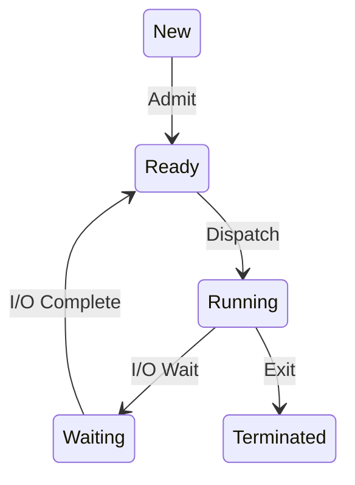

# StudyRAG — Offline Local AI Study Assistant

> **StudyRAG** is an offline-first, locally hosted AI study assistant designed to help students learn from their own academic materials. It combines document ingestion, retrieval-augmented generation (RAG), local language models, source-aware answers, and a visual-learning engine for technical diagrams.

**Project status:** Active development  
**Current development line:** v2.2 / v2.3 visual-learning improvements (see [Version History](#version-history))  
**Primary goal:** Keep normal study and RAG workflows local, private, and usable on modest hardware.

---

## Table of contents

- [Overview](#overview)
- [Project goals](#project-goals)
- [Key features](#key-features)
- [How StudyRAG works](#how-studyrag-works)
- [Technology stack](#technology-stack)
- [Visual Learning Engine](#visual-learning-engine)
- [Version history](#version-history)
- [Architecture](#architecture)
- [Project structure](#project-structure)
- [Requirements](#requirements)
- [Installation](#installation)
- [Configuration](#configuration)
- [Running StudyRAG](#running-studyrag)
- [Adding study materials](#adding-study-materials)
- [API overview](#api-overview)
- [Privacy and offline operation](#privacy-and-offline-operation)
- [Performance notes](#performance-notes)
- [Troubleshooting](#troubleshooting)
- [Testing](#testing)
- [Roadmap](#roadmap)
- [Contributing](#contributing)
- [Security](#security)
- [License](#license)
- [Acknowledgements](#acknowledgements)

---

## Overview

StudyRAG is a local AI study assistant that can use academic documents—such as syllabus files, lecture notes, textbooks, previous examination papers, lab manuals, and PDFs—to help answer study questions.

Rather than relying only on a model's general knowledge, the RAG workflow retrieves relevant passages from a user's local material and supplies those passages to a local language model. Where supported by the application, answers and generated learning artifacts can include document names and page references.

StudyRAG is intended to grow into a portable, resource-conscious study tool that can operate without paid cloud AI APIs during normal use.

### What it is

- A local academic assistant built around retrieval and grounded generation.
- A document-based study workflow for PDFs and other supported academic resources.
- A platform for explanations, revision, and technical diagrams.
- A modular project that can add optional local visual-generation backends over time.

### What it is not

- It is not guaranteed to answer every question correctly.
- A citation does not automatically prove that a statement is supported; sources should be checked.
- Mermaid diagrams are structured technical diagrams, not photorealistic AI-generated images.
- Optional AI image generation is **not considered available** unless a compatible local image model is installed and verified.

---

## Project goals

1. **Local-first AI:** Use local models and local storage for normal RAG operations.
2. **Grounded answers:** Retrieve relevant academic content and retain source metadata.
3. **Useful citations:** Preserve document names and page numbers when available.
4. **Modular architecture:** Keep ingestion, retrieval, generation, and visualization responsibilities separate.
5. **Resource awareness:** Support modest CPU/RAM systems and avoid unnecessary model downloads.
6. **Visual learning:** Generate useful technical diagrams and, in a future/optional path, support real local AI illustrations.
7. **Maintainability:** Add tests, clear configuration, documentation, and explicit error states.

---

## Key features

Feature availability depends on the version and the code currently present in the repository.

| Feature | Description | Status |
|---|---|---|
| Local LLM integration | Communicates with a local Ollama model | Implemented in development |
| PDF ingestion | Extracts text and page information from PDFs | Project capability; verify current ingestion path |
| Text chunking | Splits material into retrieval-friendly passages | Project capability; verify current implementation |
| Local embeddings | Embeds document chunks locally | Project capability; verify configured embedding model |
| Vector retrieval | Uses a local vector store such as FAISS where configured | Project capability; verify current configuration |
| Grounded answers | Supplies retrieved passages to the local model | Implemented in the RAG workflow; verify current routes |
| Source metadata | Tracks document/page information when available | Supported by the visual/RAG workflow |
| Mermaid technical diagrams | Creates flowcharts, sequence diagrams, and state diagrams | In development; diagram-type and rendering fixes may be required |
| SVG export | Export rendered diagrams | Verify in the running version |
| PNG export | Convert rendered diagrams to PNG | Optional; verify browser conversion support |
| Conversation history | Conversation-related API is present in development logs | Verify persistence and UI behavior |
| Local AI image generation | Generates raster illustrations using a local image model | Planned/optional; not available unless a backend is installed and tested |
| Offline operation | Avoids cloud AI calls in the normal local workflow | Design goal; verify all runtime dependencies and assets are local |

**Documentation note:** This README describes the intended project and development history. Check the actual repository before treating a feature as production-ready.

---

## How StudyRAG works

### RAG workflow

```text
Academic PDFs / Notes / Textbooks
                |
                v
        Document Ingestion
                |
                v
      Text Extraction + Cleanup
                |
                v
       Academic-Aware Chunking
                |
                v
      Local Embedding Generation
                |
                v
       Local Vector Store (FAISS)
                |
                v
           User Question
                |
                v
       Retrieve Relevant Chunks
                |
                v
     Local Ollama Language Model
                |
                v
     Answer + Available Citations
```

The exact ingestion, embedding, storage, and retrieval components depend on the current repository configuration.

### Visual-learning workflow

```text
                    User request
                         |
                         v
                 Visual Learning Engine
                    /           \
                   v             v
          Technical diagram   Illustration request
                   |             |
                   v             v
               Mermaid.js    Optional local image model
                   |             |
                   v             v
                  SVG          PNG/JPEG
```

The Mermaid path can create structured technical diagrams. The illustration path requires a separate compatible image-generation backend; it must not be simulated by returning a Mermaid SVG.

---

## Technology stack

| Technology | Purpose |
|---|---|
| Python | Backend and application logic |
| Flask | Web application and API routes |
| Ollama | Runs local language models |
| Qwen3:1.7B | Current small local language model used during development |
| PyMuPDF | PDF text extraction, where used |
| Sentence Transformers | Local embedding generation, where configured |
| FAISS | Local vector similarity search, where configured |
| Mermaid.js | Browser rendering of technical diagrams |
| HTML, CSS, JavaScript | User interface and browser behavior |
| JSON | Visual-artifact metadata and other structured data |
| pytest / existing test tools | Automated tests, depending on project setup |

Dependencies and exact versions should be taken from `requirements.txt`, lock files, and the actual code—not inferred from this README.

### Current local model

The development setup has used:

- **Runtime:** Ollama
- **Model:** `qwen3:1.7b`

This is a compact text model, not an image-generation model. Quality, speed, and valid structured output depend on prompt design, model output, decoding settings, and validation. A successful model response does not guarantee valid Mermaid syntax.

---

## Visual Learning Engine

The visual system has two separate output types.

### 1. Technical diagrams — Mermaid.js

Suitable for:

- TCP handshakes and connection teardown
- Operating-system process states
- Network topologies
- Compiler pipelines
- Algorithms and flowcharts
- Component relationships
- Sequence diagrams

Typical pipeline:

```text
Question -> Local model -> Structured response -> Mermaid source
         -> Validation -> Mermaid.js -> Rendered SVG
```

Supported diagram types targeted by the current development work:

- `flowchart`
- `sequenceDiagram`
- `stateDiagram-v2`

The source must be valid for its selected diagram type. For example, state transitions use `New --> Ready : Admit`; they should not be represented as `[New]--[Admit]--[Ready]`.

#### Required reliability behavior

- Parse the model response into structured fields.
- Store Mermaid source in the dedicated `mermaid_code` field.
- Keep the explanation as readable prose.
- Reject empty or obviously incomplete source.
- Handle Mermaid rendering errors and clear the loading state.
- Keep source code separate from the normal rendered view.
- Preserve grounding status and source references.
- Do not mark an artifact valid merely because the API returned HTTP 200.

### 2. Real AI-generated illustrations — optional future backend

Examples:

- An educational illustration of CPU cache hierarchy
- A conceptual illustration of how a firewall works
- A visual representation of a cybersecurity operations center

This requires a separate local image-generation model and compatible runtime. It may require substantial RAM, disk space, and compute resources.

**Current status:** Planned/optional unless a real backend has been installed and successfully tested. Do not describe image generation as working merely because a Mermaid diagram was created.

### Visual artifact metadata

An artifact may include fields such as:

- `artifact_id`
- `title`
- `prompt`
- `artifact_type`
- `diagram_type`
- `mermaid_code`
- `explanation`
- `grounding_status`
- `source_references`
- `validation_status`
- `error_message`
- `created_at`
- `metadata`

The actual schema in the repository is authoritative. Existing artifacts may use different field names or older formats.

---

## Version history

The version history below records the development stages and intended capabilities discussed for StudyRAG. It is **not a claim that every feature in every version has been merged, tested, or released**. Confirm tags, branches, and commits in Git before publishing release claims.

### v1.0 — Core local RAG foundation

**Goal:** Establish the base offline study-assistant workflow.

Planned/core capabilities:
- Initial Flask application structure
- Local Ollama integration
- PDF/document ingestion path
- Text cleaning and chunking
- Local embeddings and vector retrieval
- Retrieval-grounded responses

**Release status:** Historical foundation; confirm exact implementation from repository history.

### v1.1 — Ingestion and retrieval improvements

**Goal:** Improve document processing and source-aware retrieval.

Development scope:
- More reliable PDF ingestion
- Academic-friendly chunking
- Local embedding persistence
- Retrieval integration with Ollama
- Improved source/page metadata handling
- Tests and clearer module boundaries

**Release status:** Development milestone; verify the implementation and release tag.

### v2.0 — Visual Learning Engine foundation

**Goal:** Introduce generated technical diagrams into the study workflow.

Development scope:
- Visual request handling
- Diagram-generation service
- Mermaid source generation
- Visual artifact storage
- API and frontend integration
- Grounding metadata for visual artifacts

**Release status:** Development milestone; confirm the merged code.

### v2.1 — Artifact validation and UI integration

**Goal:** Make diagram generation more structured and robust.

Development scope:
- Structured model responses
- Separate artifact fields for title, Mermaid source, and explanation
- Artifact validation status
- Error metadata
- Diagram-card rendering
- SVG/PNG and copy-code controls where implemented

**Known concern:** Model output may be malformed or stored in the wrong field unless parsing and validation are correctly implemented.

### v2.2 — Visual Learning Engine improvements

**Goal:** Stabilize the visual pipeline without rebuilding the project.

Development scope:
- Audit existing architecture before changes
- Local Mermaid asset integration
- Improved rendering and error handling
- RAG-grounded diagram generation
- Artifact persistence
- Export controls
- Tests and documentation
- Resource-conscious implementation

**Known issues observed during development:**
- A generated artifact had an empty `mermaid_code` field.
- The model's JSON response was incorrectly stored as a string in `explanation`.
- The model emitted a state diagram with invalid syntax.
- A TCP sequence diagram appeared visually flattened and required investigation of its source, SVG, DOM, and CSS.

These observations mean the visual pipeline still requires verification; they should not be presented as resolved without tests.

### v2.3 — Diagram-type-aware generation and image-backend architecture

**Goal:** Correct diagram-type-specific generation and prepare an optional path for actual AI image generation.

Planned scope:
- Separate rules for flowcharts, sequence diagrams, and state diagrams
- Structured output parsing
- Type-aware validation
- Reliable SVG rendering
- Clear failure states and bounded retries
- A visual router that distinguishes technical diagrams from illustrations
- Capability detection for local image-generation backends
- Optional image artifact storage and metadata
- No automatic large model downloads

**Release status:** Planned/development target. Only mark it released after implementation, tests, and actual browser verification.

### Future releases

Potential future work:
- More diagram types
- Better retrieval evaluation
- Improved source attribution and answer verification
- Document management UI
- Portable deployment
- Optional, tested local image generation
- Export and accessibility improvements
- Performance and memory profiling

### How to verify the installed version

From the repository directory:

```bash
git status
git log -10 --oneline --decorate
git tag --list
```

If the application exposes a version constant or package metadata, use that as well. Do not infer the installed version solely from this README.

---

## Architecture

A conceptual modular layout:

```text
StudyRAG/
├── app.py
├── config/
├── core/
│   └── ollama_client.py
├── ingestion/
├── retrieval/
├── embeddings/
├── rag/
├── visual_learning/
│   ├── diagram_service.py
│   └── storage.py
├── vectorstore/
├── data/
│   └── generated_visuals/
├── templates/
├── static/
├── tests/
├── scripts/
├── requirements.txt
└── README.md
```

This is a conceptual map based on the development structure. The actual repository may contain additional modules or use different names. Inspect the current tree before adding or renaming directories.

### Architectural responsibilities

- **Application/API layer:** Receives requests and coordinates services.
- **Ingestion:** Extracts and prepares academic document content.
- **Embeddings:** Converts text into vectors using a local embedding model.
- **Retrieval:** Finds relevant chunks from local indexed material.
- **RAG/generation:** Supplies retrieved context to the local LLM.
- **Visual learning:** Generates and validates diagrams and routes optional illustration requests.
- **Storage:** Persists indexes, document metadata, conversations, and visual artifacts according to the configured implementation.
- **Frontend:** Displays answers, citations, diagrams, errors, and available export controls.
- **Tests:** Validate behavior and prevent regressions.

---

## Requirements

Baseline requirements depend on the current `requirements.txt` and system setup.

Typical components:

- Linux, Windows, or another OS supported by the installed dependencies
- Python version compatible with the project's dependency files
- Ollama installed and running locally
- A local text model such as `qwen3:1.7b`
- Sufficient disk space for Python packages, models, PDFs, and indexes
- A modern browser for the web UI
- Local Mermaid JavaScript asset for offline diagram rendering

Optional components, depending on enabled features:

- Embedding model files
- FAISS index storage
- Browser support for PNG export
- A compatible local image-generation runtime and model

---

## Installation

These instructions are a general starting point. Use the repository's actual setup instructions and dependency files when they differ.

### 1. Clone or open the project

If the project is already on your machine:

```bash
cd ~/StudyRAG
```

Otherwise, clone the repository using its actual remote URL.

### 2. Create a virtual environment

```bash
python3 -m venv .venv
source .venv/bin/activate
```

On Windows PowerShell:

```powershell
python -m venv .venv
.venv\Scripts\Activate.ps1
```

### 3. Install dependencies

```bash
python -m pip install --upgrade pip
pip install -r requirements.txt
```

Review dependency changes before installing if disk space or memory is limited.

### 4. Install and verify Ollama

Install Ollama using its official installation instructions for your operating system.

Verify it:

```bash
ollama --version
ollama list
```

If the configured model is not installed, download it explicitly when you have sufficient bandwidth and disk space:

```bash
ollama pull qwen3:1.7b
```

Do not download a model automatically from application code.

### 5. Verify configuration

Check the project's `.env.example`, configuration files, and README instructions. Configure local model names, data paths, and service addresses as required.

### 6. Start the application

Use the entry point and command supported by the current repository. Common possibilities include:

```bash
python app.py
```

or a Flask CLI command, depending on the actual application.

Do not assume a command works without checking the project configuration.

---

## Configuration

Use the existing configuration system. Do not hardcode local paths, secrets, or model settings in multiple modules.

Potential settings include:

| Setting | Purpose |
|---|---|
| Ollama base URL | Local Ollama API endpoint |
| Text model name | Model used for generation |
| Embedding model | Local embedding model |
| Data directory | Document and artifact storage |
| Vector-store directory | Location of local index |
| Maximum context/chunk count | Controls retrieval context size |
| Generation token limit | Limits model response size |
| `IMAGE_GENERATION_ENABLED` | Optional image-generation switch |
| `IMAGE_GENERATION_BACKEND` | Selected local image backend |
| `IMAGE_GENERATION_MODEL` | Explicit image model identifier |

For an optional image-generation backend, a conservative default is:

```dotenv
IMAGE_GENERATION_ENABLED=false
IMAGE_GENERATION_BACKEND=auto
IMAGE_GENERATION_MODEL=
```

These are proposed setting names, not a guarantee that they are already implemented. Match the actual names in the code.

Never commit private credentials or machine-specific secrets.

---

## Running StudyRAG

1. Start the local Ollama service.
2. Confirm the configured model is available.
3. Activate the Python environment.
4. Start the Flask application using the repository's supported command.
5. Open the local address printed by Flask.
6. Add or index academic documents using the supported ingestion workflow.
7. Ask a question about the material.
8. Inspect retrieved sources and page references when provided.
9. Request a technical diagram and verify that it renders correctly.

A successful HTTP response alone does not prove that an artifact is valid. Confirm that the actual diagram is rendered and that the source is appropriate.

---

## Adding study materials

StudyRAG is intended for materials such as:

- Course syllabi
- Lecture notes
- Textbooks
- Previous question papers
- Lab manuals
- Academic PDFs
- Personal study notes

Recommended workflow:

1. Use the application's supported document-ingestion process.
2. Confirm that text extraction succeeded.
3. Confirm that document/page metadata is retained.
4. Index the processed chunks.
5. Ask a question that should be answered by the uploaded material.
6. Check whether the cited document and page actually support the answer.

Scanned PDFs may require OCR if the current ingestion pipeline does not extract text from them. Do not assume OCR is available unless implemented.

---

## API overview

The visual workflow has used an endpoint such as:

```text
POST /api/visualize
```

The application has also logged requests to:

```text
GET /api/conversations
```

These are observed development endpoints, not a complete API specification.

Before integrating with them, inspect the current Flask routes and request/response schemas. Preserve backward compatibility when changing API contracts.

A visualization response should distinguish:

- Successful generation
- Invalid diagram source
- Rendering failure
- Missing image-generation backend
- Internal service failure

Never return success for an image unless an actual image file has been generated and saved.

---

## Privacy and offline operation

StudyRAG is designed to keep normal study workflows local.

- Local Ollama inference can avoid sending prompts to cloud LLM providers.
- Local embeddings and vector indexes can avoid external embedding APIs.
- Local document storage keeps study files under the user's control.
- Mermaid rendering can work offline when its JavaScript asset is served locally.
- Optional image generation should use a compatible local backend if offline operation is required.

**Offline-first does not automatically mean every dependency is offline.** Verify browser assets, package installation, model downloads, analytics, and optional services. Downloads during installation require network access, but normal operation should not need cloud inference if the application is configured correctly.

---

## Performance notes

The target development laptop has approximately 8 GB RAM and an Intel i5-6300U CPU with integrated graphics.

Recommended practices:

- Keep the current compact text model unless profiling demonstrates a clear need to change it.
- Limit retrieval context and generation token counts.
- Avoid loading multiple large models simultaneously.
- Avoid automatic model downloads.
- Cache local embeddings and indexes where safe.
- Keep retries bounded.
- Prefer lightweight diagram rendering for technical content.
- Make image generation optional and disabled by default until a compatible backend is tested.
- Measure actual memory and response time instead of promising a particular speed.

CPU-only AI image generation can be slow and memory-intensive. Check the chosen model's actual requirements before installing it.

---

## Troubleshooting

### Ollama is not responding

```bash
ollama list
```

Confirm Ollama is running and the configured model is available. Inspect application logs for connection errors.

### Diagram card stays on “Rendering diagram…”

Inspect:

1. Browser Developer Tools → Console.
2. Developer Tools → Network → the visualization API response.
3. The exact Mermaid source saved in the artifact.
4. The installed Mermaid version and browser asset.
5. The generated SVG and its container dimensions.

Ensure the frontend clears its loading state on both success and failure.

### `mermaid_code` is empty

Inspect the model-response parser. The model's JSON may have been stored inside the explanation field rather than parsed into dedicated artifact fields. Validate the extracted source before saving the artifact.

### State diagram parse error

Use Mermaid state-diagram syntax, for example:



Do not use flowchart syntax for a state diagram.

### TCP sequence diagram looks flattened

Inspect the generated source and actual SVG first. If the source is valid, inspect the DOM, CSS, SVG viewBox, dimensions, and Mermaid rendering API. Avoid arbitrary global CSS changes.

### No AI image-generation backend

This is expected unless a compatible local image model and runtime have been installed and tested. Mermaid diagrams remain a separate feature and should not be presented as AI-generated illustrations.

### Answers do not cite sources

Check document ingestion, page metadata, retrieval results, and the answer-generation prompt. General-knowledge answers should be distinguished from answers grounded in retrieved study material.

---

## Testing

Run the tests supported by the repository. If it uses pytest, a common command is:

```bash
pytest
```

Check the actual project test configuration before relying on this command.

Recommended coverage:

- PDF extraction and page metadata
- Chunking and retrieval
- Local generation failures
- Source attribution
- Structured JSON parsing
- Empty Mermaid source
- Valid and invalid flowcharts
- Valid and invalid sequence diagrams
- Valid and invalid state diagrams
- Artifact storage and retrieval
- API response schemas
- Frontend loading-state cleanup
- Mermaid rendering failures
- SVG/PNG export
- Missing optional image backend

Mock model calls in unit tests when practical. In addition to unit tests, verify real model output and actual browser rendering before declaring the visual engine stable.

---

## Roadmap

Potential next steps, subject to repository status:

- [ ] Stabilize structured model-response parsing.
- [ ] Validate Mermaid syntax by diagram type.
- [ ] Fix and verify TCP sequence-diagram rendering.
- [ ] Fix and verify OS state-diagram rendering.
- [ ] Ensure loading indicators always resolve.
- [ ] Preserve source/page citations on generated diagrams.
- [ ] Test SVG export and PNG conversion.
- [ ] Improve artifact schema compatibility.
- [ ] Add visual-generation capability detection.
- [ ] Implement an optional local image-generation backend after hardware/model evaluation.
- [ ] Improve offline installation and local asset checks.
- [ ] Add end-to-end tests and performance measurements.

Update this checklist as work is completed; do not mark an item complete without verification.

---

## Contributing

Contributions should preserve the project's local-first and resource-conscious goals.

1. Inspect existing architecture before changing it.
2. Keep changes focused and modular.
3. Add tests for new behavior and regressions.
4. Preserve existing user documents, indexes, conversations, and artifacts.
5. Avoid destructive Git commands and force pushes unless explicitly intended and reviewed.
6. Document new configuration and dependencies.
7. Do not claim a feature is working without testing it.

---

## Security

- Treat uploaded documents and model-generated output as untrusted input.
- Validate API payloads and enforce reasonable size limits.
- Prevent path traversal and arbitrary file writes.
- Do not execute generated content.
- Avoid unsafe HTML insertion.
- Sanitize or safely handle SVG content before serving or exporting it.
- Keep secrets out of source control.
- Bind development services appropriately and do not expose local inference or Flask debug services to untrusted networks.
- Keep dependencies updated and review their licenses.

---

## License

Add the project's chosen license here before distributing it. Until a license is included, do not assume that others have permission to reuse, modify, or redistribute the code.

---

## Acknowledgements

StudyRAG brings together local AI inference, retrieval, document processing, vector search, and browser-based diagram rendering. It is built with the goal of making academic study tools more private, accessible, and practical on everyday hardware.

---

**Maintainer note:** Keep this README aligned with the actual repository. Before a public release, verify the feature-status table, version tags, installation commands, configuration names, API schemas, and test results against the current code.
